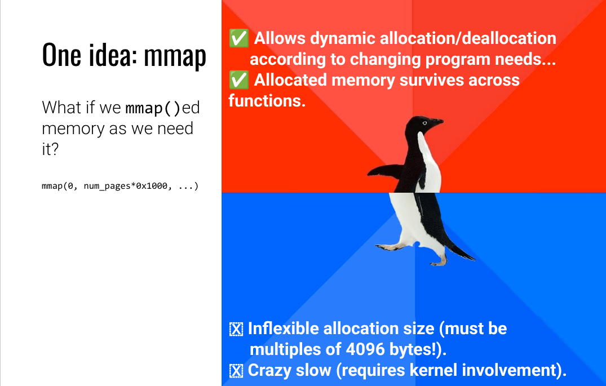
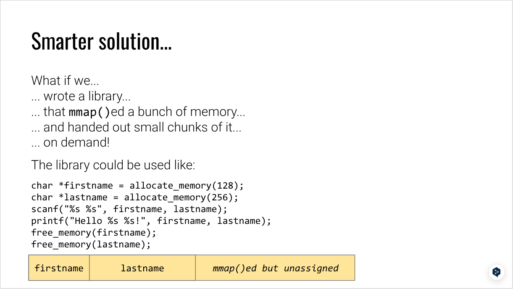
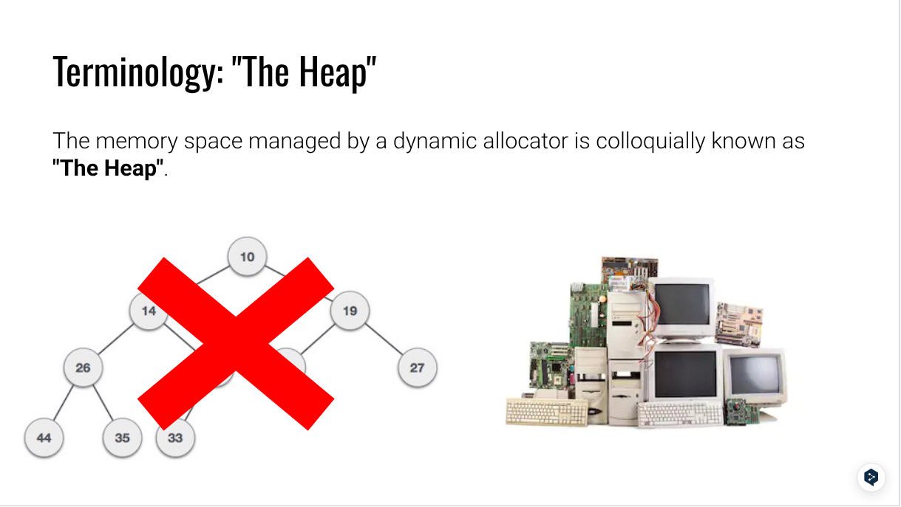
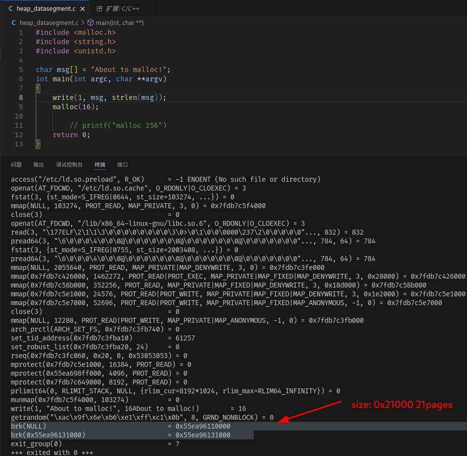
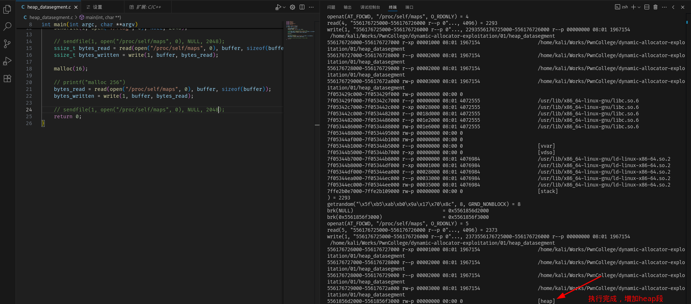
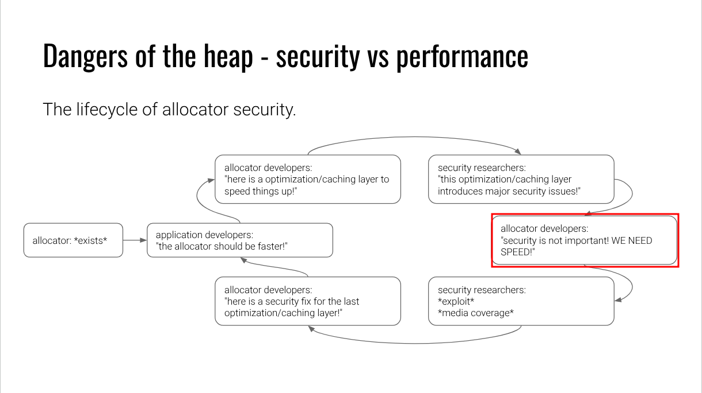

glibc堆由许多不同的组件构成，这些组件在性能与安全性之间取得平衡。在本堆内存简介中，我们将重点探讨线程缓存层（tcache）的利用方法。tcache是一种快速的线程专用缓存层，通常是使用动态内存分配的程序的首要交互点。

## What is the Heap?

Heap

- long-lived dynamic memory.(Example: a variable-length list of NPCs in a game.)

Memroy types:

- ELF .text: where the code lives

- ELF .plt: where library function stubs live

- ELF .got: where pointers to imported symbols live

- ELF .bss: used for uninitialized global writable data (such as global arrays without initial values)

- ELF .data: used for pre-initialized global writable data (such as global arrays with initial values)

- ELF .rodata: used for global read-only data (such as string constants)

stack: local variables, temporary storage, call stack metadata

如果你想要动态的内存分配？

### One idea: mmap

优点：

- 支持动态分配

- 支持内存长生命周期，跨functions



缺点

- 必须是4096bytes的整数倍内存大小

- Crazy slow, 涉及内核参与，非常慢

### Smarter idea

- 很容易想到的方式，也是很多内存管理MMU的做法
  - 预先分配大内存，然后再分割为小内存进行管理



<mark>History:</mark>

- 1987: General Purpose, dlmalloc

- Linux: ptmalloc(Posix Thread aware fork of dlmalloc，dlmalloc的分支版本，支持Posix Thread)

- FreeBSD: jemalloc(Android, Firefox)

- Windows: Segment Heap, NT Heap

- Knernel allocators:
  - kmalloc: Linux kernel memory allocator
  - kalloc: iOS kernel memory allocator

### 常见误区：堆 vs 堆数据结构

类似二叉堆容易引发混淆：

- ​**​堆内存（Memory Heap）​**​：是物理内存中的存储区域，与程序如何组织数据无关。

- ​**​堆数据结构（Data Structure Heap）​**​：是一种特殊的完全二叉树（满足“父节点值≥子节点值”），用于优先队列等算法，与内存管理无关。

  ​**​二者仅名称相似，本质完全不同！​**



由ptmalloc/glibc（及类似实现）实现的堆内存提供了以下功能：

- `malloc()`：分配一块内存空间；

- `free()`：释放之前分配的内存块。

此外还有一些辅助函数：

- `realloc()`：调整已分配内存块的大小；

- `calloc()`：分配内存并将内存初始化为零。

几乎所有的软件（即功能复杂、非简单脚本的程序）都会大量使用这些函数。

### How does heap work?

- ​**​小分配场景​**​：ptmalloc 确实主要通过 `brk/sbrk`管理数据段，不直接使用 `mmap`；
  - starts out with a size of 0
  - managed by the brk and sbrk system calls:
    - sbrk(NULL) returns the end of the data segment
    - sbrk(delta) expands the end of the data segment by delta bytes
    - brk(addr) expands the end of the data segment to addr\*\*

- ​**​大分配场景​**​：ptmalloc 必然使用 `mmap`（否则无法高效管理大内存块）。

**大内存分配（通常 > 128KB）​**​：

- ​**​使用 `mmap`​**​：ptmalloc 会直接向操作系统申请一块独立的匿名内存映射（通过 `mmap`），并将其作为独立的内存块返回给程序。这是因为大内存块若从数据段切分，会导致数据段过度膨胀，且难以回收（数据段只能整体收缩，无法释放中间碎片）。

- ​**​优势​**​：`mmap`分配的内存块可被操作系统独立管理（如通过 `munmap`直接回收），避免了堆碎片的累积；同时，大内存块的分配/释放对数据段的影响较小。

### Dangers of the heap

下面是非常好的表述

- 即Coding时出现的bug由于allocator没有捕获到，变成了安全问题

What can go wrong?

The heap is:

1. used by imperfect human programmers

- humans forget to free memory

- humans forget all the spots where they store pointers to data

- humans forget what they've freed

2. a library that strives for performance

- allocation and deallocation needs to be fast, or programs will slow down

- optimizations often leave security as an afterthought

<mark>Bugs caused by #1</mark> become security issues due to <mark>#2 if not caught!</mark>

### How to detect issues?

- valgrind can detect heap misuse (if your testcases trigger it)

- glibc itself has some hardening techniques:

- export MALLOC*CHECK*=1

- export MALLOC*PERTURB*=1

- export MALLOC*MMAP_THRESHOLD*=1

- there are various "more secure" allocators being developed (but not really deployed)

<mark>Like many other issues, no general techniques exist for detecting dynamic allocation errors...</mark>

### Practices



读取`/proc/self/maps`文件



## Dangers

"security is not important! WE NEED SPEED!"



### Misuse the heap

- Forgetting to free memory
  - 资源耗尽

- Forgetting that we _have_ freed memory
  - using free memory
  - freeing free memory

- Corrupting metadata used by the allocator to keep track of heap state.(破坏heap内部状态)
  - conceptually similar to corruption internal function state on the stack

### Memory Leaks

```c
int main()
{
    char *blah = malloc(1024);
    //
    return 1;
}
```
